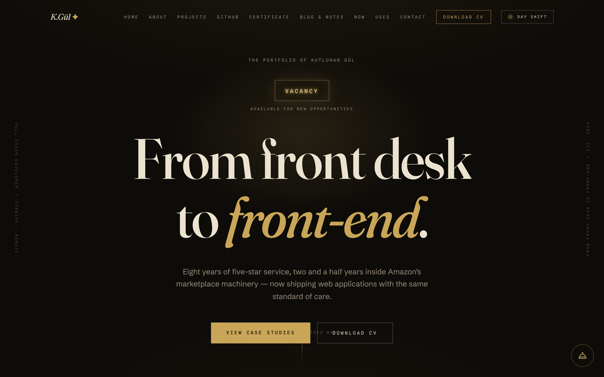
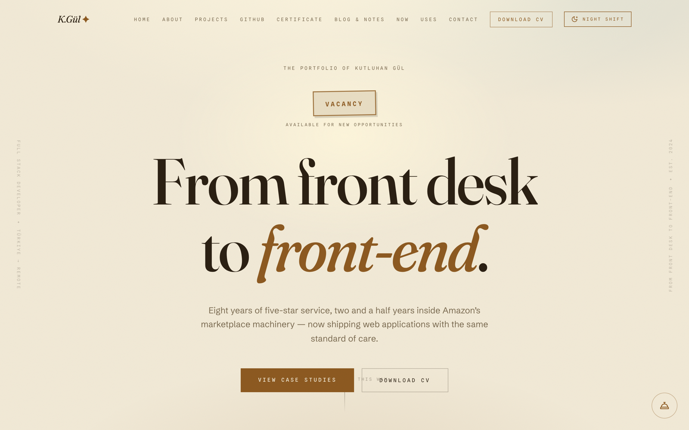
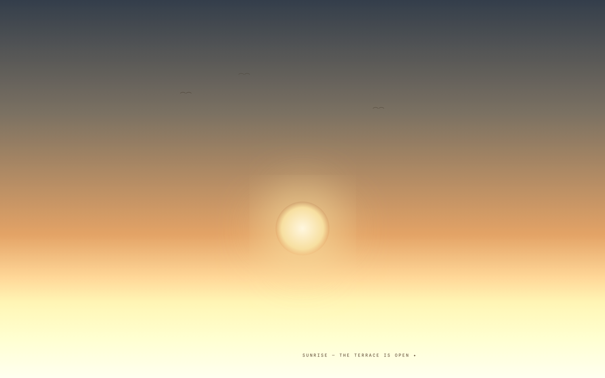
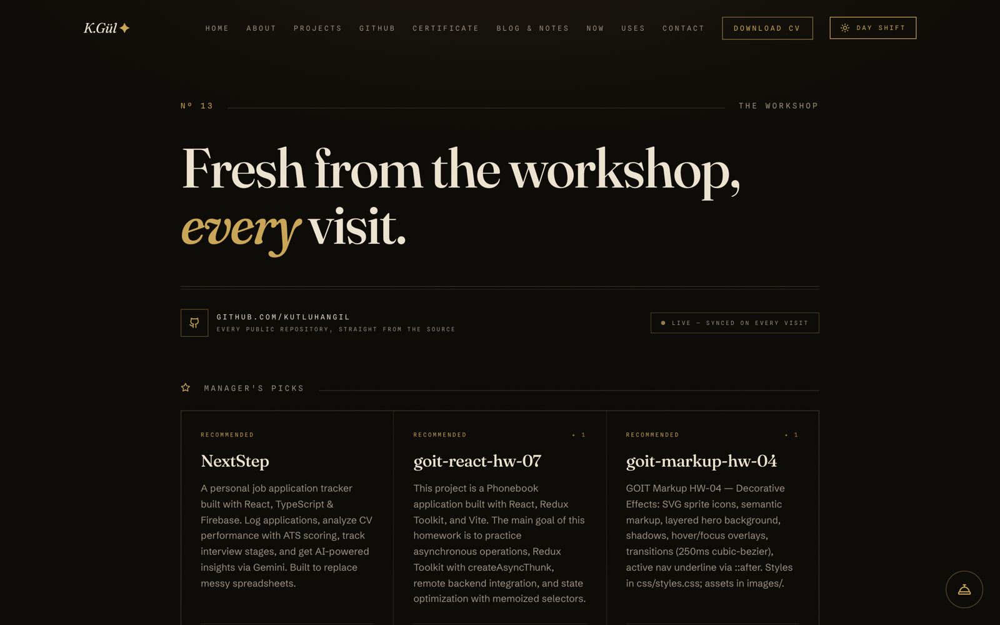
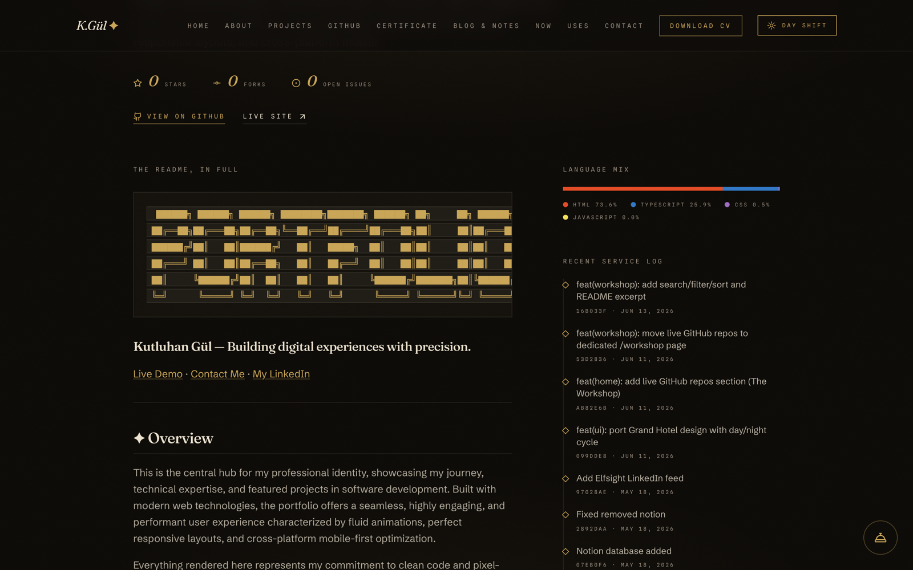
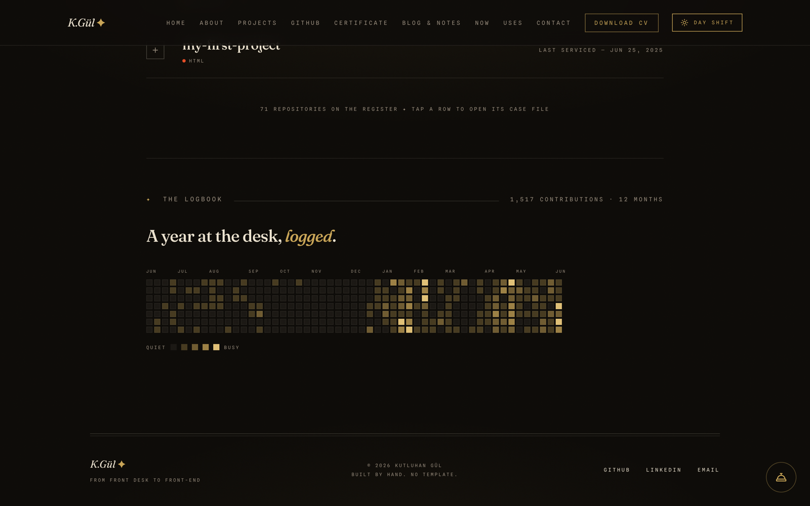

<div align="center">

<br />


<br /><br />

# K.Gül ✦

### Building digital experiences with precision — *from front desk to front‑end*.

[Live Site](https://kutluhangul.com) · [Case Studies](https://kutluhangul.com/#projects) · [The Workshop](https://kutluhangul.com/workshop) · [LinkedIn](https://linkedin.com/in/kutluhangil)

</div>

---

## ✦ Overview

My personal portfolio, themed as **a grand hotel**. The whole site lives in one of two worlds and flips between them with a full sunrise/sunset animation:

- **🌙 Night** — the lobby after midnight: ink-black, brass lamplight, a flickering neon *VACANCY* sign.
- **☀️ Day** — the morning terrace: sun-bleached linen, espresso ink, the same sign with the power off.

Toggle the light and the sun actually rises or sets across the screen — stars switch on, a crescent moon climbs, birds cross at dawn — while the theme swaps underneath, fully covered.

<div align="center">
<br />


<br />
<em>Same hotel, two worlds — night (left) and day (right).</em>
<br /><br />

<br />
<em>The day/night cycle mid-flight — the sun crossing the horizon.</em>
</div>

---

## ⚡ What's on the site

| Section | What it does |
|--------|-------------|
| 🏨 **The Lobby** *(Home)* | Hero with the live neon vacancy sign, a running marquee of skills, and the full story. |
| 🗂️ **Case Studies** *(Projects)* | Featured project work in scrubbable modals — tour each app without leaving the page. |
| 🛠️ **The Workshop** *(GitHub)* | Every public repo, pulled **live** from the GitHub API on each visit — no redeploy needed. |
| 🎖️ **Credentials** | GoIT Full Stack certificate, framed and downloadable. |
| 📖 **Blog & Notes**, **Now**, **Uses** | Writing, current focus, and the daily toolkit — all in the hotel's voice. |
| 📇 **The Guest Book** *(Contact)* | Web3Forms-powered message form + a live LinkedIn feed. |
| 🌗 **Day / Night cycle** | Animated sunrise/sunset theme switch, reduced-motion safe. |

---

## 🛠️ The Workshop — live GitHub, no maintenance

The standout feature. The `/workshop` page reads the GitHub API directly from the browser, so **anything pushed to [github.com/kutluhangil](https://github.com/kutluhangil) appears on the site automatically** — there is nothing to redeploy and no data to keep in sync.

<div align="center">
<br />

<br />
<em>Manager's Picks up top, then a searchable / filterable register of every repository.</em>
</div>

It includes:

- **Manager's Picks** — top 3 repos auto-selected by a blend of stars, freshness, and polish (description, homepage, topics).
- **Search · filter · sort** — live text search (name, description, topics), language-filter chips, and sort by recent / stars / name.
- **Accordion case files** — each row expands to a README excerpt, language-mix bar, topics, and dates.
- **Full case file** at `/workshop/:repo` — the complete README rendered, the latest commits ("service log"), language breakdown, stars / forks / open issues.
- **The Logbook** — a year of contributions rendered as a brass calendar heatmap.

<div align="center">
<br />

<br />
<em>A single repository's case file — README rendered in full, with a live commit service log.</em>
<br /><br />

<br />
<em>The Logbook — a year at the desk, logged.</em>
</div>

> **Note:** the public GitHub API allows ~60 requests/hour per visitor (unauthenticated). The site fetches the repo list once and loads README / language / commit data lazily on demand, cached client-side, to stay well within that limit.

---

## 🛠️ Tech Stack

```
Core              →  React 18 · TypeScript · Vite
Styling           →  Tailwind CSS · Fraunces / Schibsted Grotesk / Spline Sans Mono
Animations        →  Framer Motion (day/night cycle, page & section reveals)
Routing & State   →  Wouter · Next Themes · TanStack Query
Markdown          →  react-markdown · remark-gfm  (README rendering)
Data              →  GitHub REST API + github-contributions-api (live, no token)
Forms             →  Web3Forms (contact + newsletter)
Deployment        →  Vercel (static SPA)
```

All site copy lives in [`client/src/data/content.ts`](client/src/data/content.ts) — edit that one file to change text; never the components.

---

## 🚀 Getting Started

### Prerequisites
- Node.js `>= 18`
- npm

### Local development

```bash
git clone https://github.com/kutluhangil/kutluhangul.com.git
cd kutluhangul.com
npm install

# Dev server (the port 5000 default may be taken by AirPlay on macOS)
PORT=3000 npm run dev
```

---

## 📐 Project Structure

```
kutluhangul.com/
├── client/
│   ├── public/                 # Static assets (favicon, images, PDF resume, certificate)
│   └── src/
│       ├── components/         # Hero, About, Projects, Logbook, DayNightCycle, etc.
│       ├── pages/              # Home · Blog · Now · Uses · Workshop · WorkshopRepo
│       ├── data/content.ts     # ← all site copy lives here
│       └── lib/
├── server/                     # Express (local dev only — Vercel serves static)
├── docs/screenshots/           # README imagery
├── vite.config.ts
├── vercel.json                 # SPA rewrite config
└── package.json
```

---

## ☁️ Deployment

Deployed on Vercel as a **static SPA** (`outputDirectory: dist/public`). The `vercel.json` rewrite sends every path to `index.html`, so client-side routes like `/workshop` and `/workshop/:repo` resolve on direct visits. Pushing to `main` triggers an automatic deploy.

---

## 🤝 Contact

* Email — [kutluhangil@gmail.com](mailto:kutluhangil@gmail.com)
* LinkedIn — [Kutluhan Gül](https://linkedin.com/in/kutluhangil)
* GitHub — [kutluhangil](https://github.com/kutluhangil)

---

<div align="center">

Built by hand. No template. ✦ © 2026 Kutluhan Gül

</div>
