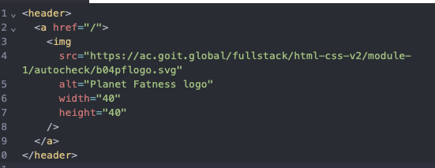

# LOGO

Web sitesi logosu başlığa yerleştirilir ve her zaman ana sayfaya bir bağlantı sağlar. Logo biçimlendirmesi, tasarıma bağlı olarak değişiklik gösterebilir. Şöyle olabilir

- metin;

`<a href="">Şirket web sitesi logosu</a>`

- görüntü;

`<a href="">
	
</a>`

- veya metin ve görüntünün bir kombinasyonu.

`<a href="">
	
	Şirket web sitesi logosu
</a>`

Lütfen aşağıdaki logo koduna bakın. İçine iki bağlantı eklemeniz gerekiyor.

`<a href="**Adres 1**">
	
	... 
</a>`

Adres 1 markanın ana sayfasının adresidir.

Adres 2 logo görselinin görüntülendiği adrestir.

Başlıktaki metni kaldırın ve `40` piksel yüksekliğinde ve `40` piksel genişliğinde bir görüntü içeren bir bağlantı olan `Planet Fatness` logosunu ekleyin. Aşağıdaki değeri alın.

```
Adesa linki: /
Logo bağlantısı: https://ac.goit.global/fullstack/html-css-v2/module-1/autocheck/b04pflogo.svg
Alternatif metin: Planet Fatness logo

```

- Belge `header` etiketine sahip olmalıdır.
- Sayfa başlığından önce `<header>` etiketi gelmelidir.
- Başlığın içinde bağlantılar bulunmalıdır.
- Bağlantının `href` niteliğinin değeri `/` şeklinde olmalıdır.
- Bağlantı bir resim içermelidir.
- Görüntünün `src` niteliğinin değeri `https://ac.goit.global/fullstack/html-css-v2/module-1/autocheck/b04pflogo.svg` şeklinde olmalıdır.
- Görüntünün `alt` niteliğinin değeri `Planet Fatness logo` olmalıdır.
- Logonun genişliği 40 piksel olmalıdır.
- Logonun yüksekliği 40 piksel olmalıdır.



### **Açıklama:**

- ✅ <header> etiketi belge içinde **başlıktan önce** yer aldı.
- ✅ <h1>Planet Fatness</h1> **kaldırıldı** (başlıktaki metin kaldırılmalıydı).
- ✅ <a href="/"> bağlantısı / adresini kullanıyor.
- ✅  etiketi içinde:
    - src → doğru logo bağlantısı
    - alt → “Planet Fatness logo”
    - width="40" ve height="40" → istenilen ölçüler