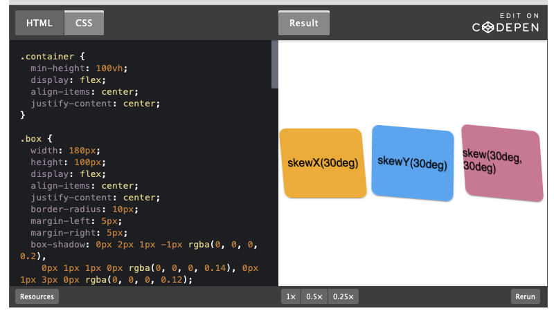

# Distorsiyon

`skewX(açı)`, `skewY(açı)` ve `skew(x-açısı, y-açısı)` fonksiyonları bir elemanın kenarlarını koordinat eksenlerine göre eğriltmek (eğmek, deforme etmek) için kullanılır. `skew()` için yalnızca bir değer belirtilirse, ikinci değer `0` olacaktır, yani `skewX()` ile eşdeğer olacaktır.

`.box {
  transform: skew(30deg);
}`

