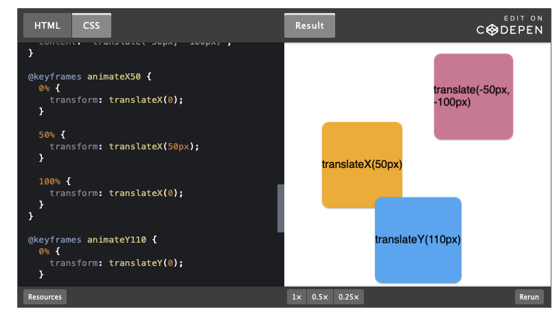

# Ofset

`translateX(tx)`, `translateY(ty)` ve `translate(tx, ty)` işlevleri, öğeyi orijinal konumuna göre yatay (X ekseni) ve/veya dikey (Y ekseni) yönlerde hareket ettirir.

- X'in pozitif değerleri öğeyi sağa, negatif değerleri ise — sola taşır.
- Y'nin pozitif değerleri öğeyi aşağı, negatif değerleri ise — yukarı hareket ettirir.

Değerler piksel veya yüzde cinsinden olabilir. Değer bir yüzde ise, taşıdığınız öğenin boyutundan hesaplanır.

`.box {
  transform: translate(100px, 200px);
}`

