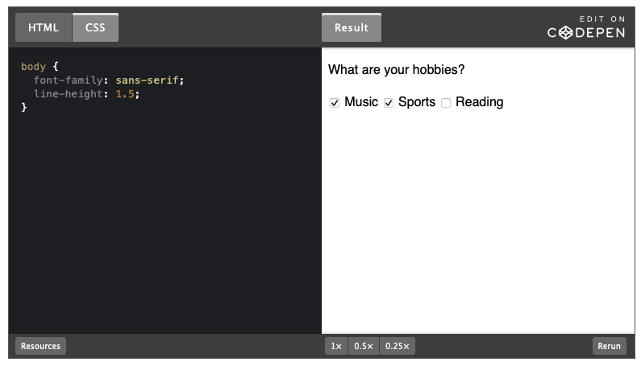
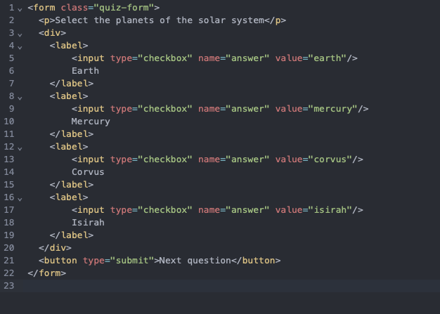

# Checkbox

Onay kutuları radyo butonlarına benzer, Radyo düğmelerinden farklı olarak, onay kutuları kullanıcıların birden fazla seçeneği seçmesine olanak tanır.

Bir onay kutusu kullanılabilir

- bireysel olarak, örneğin kayıt sırasında kullanıcı sözleşmesini kabul etmek için.
- bir grup içinde, örneğin bir hobi seçerek.

`<form>
  
What are your hobbies?

  <label>
    <input type="checkbox" name="hobby" value="music" checked />
    Music
  </label>
  <label>
    <input type="checkbox" name="hobby" value="sports" checked />
    Sports
  </label>
  <label>
    <input type="checkbox" name="hobby" value="reading" />
    Reading
  </label>
</form>`

- Gruptaki her onay kutusuna `name` niteliği için aynı değer verilir, aksi takdirde tarayıcı bunun bir grup olduğunu anlamaz.
- Onay kutularına veri girilemez, bu nedenle her birine `value` niteliğinde bir değer verilmelidir.
- `checked` niteliği, varsayılan olarak hangi onay kutusunun seçileceğini gösterir. Bir grup onay kutusunda `checked` durumunda istediğiniz kadar öğe olabilir. Varsayılan olarak hiçbiri yoktur.
    
    
    

Bir test formu oluşturun. Her etiketin metninden önce bir onay kutusu(checkbox) ekleyin. Onay kutusu grubunun adı `answer`olmalıdır.

- İlk etikete `earth` değerine sahip bir onay kutusu ekleyin.
- İkinci etikete `mercury` değerine sahip bir onay kutusu ekleyin.
- Üçüncü etikete `corvus` değerine sahip bir onay kutusu ekleyin.
- Dördüncü etikete `isirah` değerine sahip bir onay kutusu ekleyin.
- HTML düzenleyicisinin bir `form` açılış etiketi bulunmalıdır.
- HTML düzenleyicisinin bir `form` kapanış etiketi bulunmalıdır.
- `form` etiketi içinde dört adet `label` etiketi bulunmalıdır.
- İlk `label` etiketi içinde, `type=checkbox` ve `value=earth`özniteliklerine sahip bir  etiketi ile birlikte `Earth` metni bulunmalıdır. Bu  etiketi ayrıca `name=answer` özniteliğine sahip olmalıdır.
- İkinci `label` etiketi içinde, `type=checkbox` ve `value=mercury`özniteliklerine sahip bir  etiketi ile birlikte `Mercury` metni bulunmalıdır. Bu  etiketi ayrıca `name=answer` özniteliğine sahip olmalıdır.
- Üçüncü `label` etiketi içinde, `type=checkbox` ve `value=corvus`özniteliklerine sahip bir  etiketi ile birlikte `Corvus` metni bulunmalıdır. Bu  etiketi ayrıca `name=answer` özniteliğine sahip olmalıdır.
- Dördüncü `label` etiketi içinde, `type=checkbox` ve `value=isirah`özniteliklerine sahip bir  etiketi ile birlikte `İsirah` metni bulunmalıdır. Bu  etiketi ayrıca `name=answer` özniteliğine sahip olmalıdır.
    
    